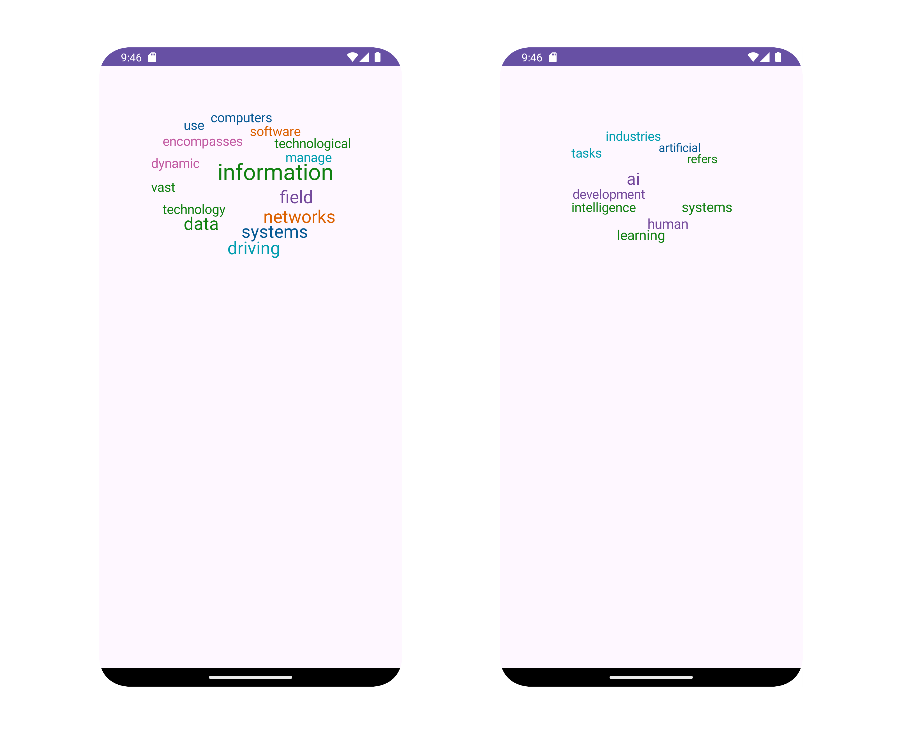

# Android Word Cloud Library


The Android Word Cloud Library is a all-in-one customizable library that allows you to easily integrate word clouds into your Android applications. This library provides a simple way to generate visually appealing and readable word clouds based on a collection of words and their frequencies OR simply provide a string!


## Installation

To use this library in your Android project, add the following dependency to your app's build.gradle file and settings gradle file:

```gradle
// build.gradle.kts
dependencies {
    implementation("com.github.jolenechong:androidWordCloud:1.0.0") {
        // exclude due to duplicate classes with the 
        // edu.stanford.nlp:stanford-corenlp dependency for data processing
        exclude(group="com.sun.xml.bind", module="jaxb-core")
        exclude(group="com.sun.xml.bind", module="jaxb-impl")
    }
}

// settings.gradle.kts
// or maven { url 'https://jitpack.io' } if you're in Java
dependencyResolutionManagement {
    repositoriesMode.set(RepositoriesMode.FAIL_ON_PROJECT_REPOS)
    repositories {
        google()
        mavenCentral()
        maven { url = uri("https://jitpack.io") } // add this
    }
}
```

## Usage
1. Add the word cloud view to your layout file: (eg. activity_main.xml)

```xml
<FrameLayout
    android:id="@+id/wordCloudView"
    android:layout_width="match_parent"
    android:layout_height="300dp"
    android:layout_margin="20dp"/>
```

2. Add the following to your activity file: (eg. MainActivity.kt)
```kotlin
import com.jolenechong.androidwordcloud.WordCloud

wordCloudView = WordCloud(application, null)
binding.wordCloudView.addView(wordCloudView)

// Set the text to be displayed in the word cloud
wordCloudView.setParagraph(
    "Add some text you'd like to see a word cloud of here",
    topN = 10,
    lemmatize = false
)

// OR use your own list of words
// doesn't have cleaning, suitable when you want to implement the cleaning yourself
wordCloudView.setWords(arrayListOf(
    "human",
    "tasks",
    "tasks",
    "AI",
    "AI",
    "AI",
    "AI",
    "systems",
    "systems",
), topN = 10)
```

## License

This project is licensed under the MIT License - see the LICENSE file for details.

## Contributing

We love contributions! Whether it's fixing a bug, adding a feature, or just improving the documentation, your help is appreciated. Here's how you can contribute:
Ways to Contribute
1. Open an Issue: Have an idea or find a bug? Open an issue! We're happy to hear your thoughts
2. Submit a Pull Request: Found a bug and know how to fix it? Want to add a cool new feature? We're all ears! Submit a pull request and let's make it happen.
3. Feature Requests: Got an idea for a feature you'd like to see? Open an issue and let's chat about it.

Getting Started
- Fork this repository to your own GitHub account.
- Clone your forked repository to your local machine.
- Work your magic! Make the changes you'd like to contribute.
- Push your changes to your fork and submit a pull request. We'll review it together.

#### No Contribution is Too Small

Whether it's a one-liner fix, a typo correction, or a massive feature, every contribution is valuable. Don't be shy; we appreciate all levels of involvement.

## Contact, Help and Feedback

If you're unsure about anything or need help, feel free to open an issue to ask questions. We're here to assist and guide you. We also welcome any feedback you may have. Let us know what you think!

Feel free to contact the maintainer directly at [jolenechong7@gmail.com](mailto:jolenechong7@gmail.com)

## Spread the Word

Enjoying the Android Word Cloud Library? Help us spread the word! Star the repository, tweet about it, or mention it in your favorite developer community.

Thank you for considering contributing. Together, let's make the Android Word Cloud Library even more awesome!

## Backlog
- [ ] Allow customizations of base font size and color palette
- [ ] Allow on click listener for each word
